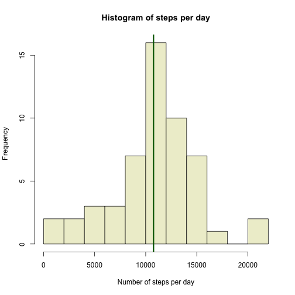
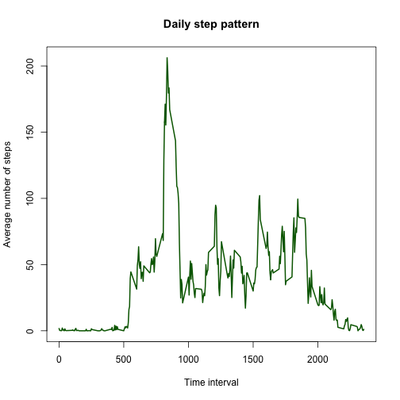
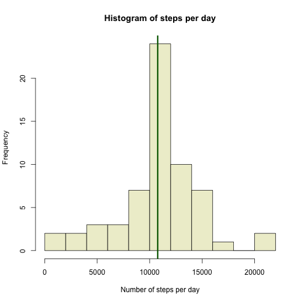
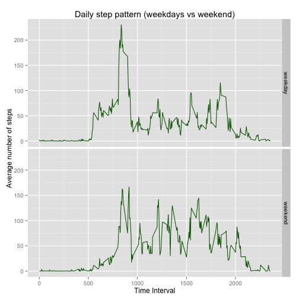

## Overview

This report analyzes data from activity monitoring devices and answers some
key questions about the data. The data comes from a personal activity 
monitoring device. The device collects data at 5 minute intervals through out 
the day. The data consists of two months of data from an anonymous individual 
collected during the months of October and November, 2012 and include the 
number of steps taken in 5 minute intervals each day.

## Loading and preprocessing the data

The data is present within the file `activity.zip` and is loaded using the 
code below. The code unzips the zip file, extracts the `activity.csv` file
within and then pre-processes it to convert characters to dates, where
appropriate, using the `lubridate` library.


```r
library(lubridate)
activityData <- read.csv(unz("activity.zip", "activity.csv"),
                         colClasses = c("numeric", "character", "numeric"))
activityData$date <- ymd(activityData$date)
summary(activityData)
```

```
##      steps             date               interval     
##  Min.   :  0.00   Min.   :2012-10-01   Min.   :   0.0  
##  1st Qu.:  0.00   1st Qu.:2012-10-16   1st Qu.: 588.8  
##  Median :  0.00   Median :2012-10-31   Median :1177.5  
##  Mean   : 37.38   Mean   :2012-10-31   Mean   :1177.5  
##  3rd Qu.: 12.00   3rd Qu.:2012-11-15   3rd Qu.:1766.2  
##  Max.   :806.00   Max.   :2012-11-30   Max.   :2355.0  
##  NA's   :2304
```

## What is mean total number of steps taken per day?

Ignoring missing values, the histogram of steps taken each day is show below 
along with the R code to generate the histogram.


```r
stepData <- activityData[!is.na(activityData$steps), ]
totalStepData <- with(stepData, rowsum(steps, date))
hist(totalStepData,
     breaks = 10,
     xlab = "Number of steps per day",
     ylab = "Frequency",
     main = "Histogram of steps per day",
     col = "lightyellow2")
meanStepsPerDay <- round(mean(totalStepData))
medianStepsPerDay <- round(median(totalStepData))
abline(v = meanStepsPerDay, col = "darkgreen", lw ="3")
```

 

As seen from the data and the histogram, 

* The _mean_ number of steps per day is 10766.
* The _median_ number of steps per day is 10765.

## What is the average daily activity pattern?

The plot below shows the daily activity pattern. It shows the the average 
number of steps taken, averaged across all days, for each time interval in the
day. 


```r
pattern <- tapply(stepData$steps, stepData$interval, mean, simplify = FALSE)
plot(names(pattern), 
     pattern, 
     main = "Daily step pattern",
     xlab = "Time interval",
     ylab = "Average number of steps",
     type = "l",
     lwd = "2",
     col = "darkgreen")
```

 

```r
maxStepsInInterval <- round(max(unlist(pattern)))
intervalWithMaxSteps <- names(which.max(pattern))
```

On average, the maximum number of steps taken within an interval is 
206 and this happens during the 
835 interval. 

## Imputing missing values


```r
numNAs <- nrow(activityData[is.na(activityData$steps), ])
```

There are 2304 missing values (NAs) in the data.

One strategy to impute the data is to use the mean for that 5-minute interval
when the number of steps is not available. A new data set without NAs can be 
created using the code below.


```r
imputedStepData <- 
    transform(activityData,
              steps = ifelse(is.na(steps), 
                             as.numeric(pattern[as.character(interval)]),
                             steps))
imputedTotalStepData <- with(imputedStepData, rowsum(steps, date))
imputedMeanStepsPerDay <- round(mean(imputedTotalStepData))
imputedMedianStepsPerDay <- round(median(imputedTotalStepData))
```

From the imputed data,

* The _mean_ number of steps per day is 10766.
* The _median_ number of steps per day is 10766.

These values are the same as with the raw data (within margin of error).

Using the imputed data, the histogram of steps taken each day is show below 
along with the R code to generate the histogram.


```r
hist(imputedTotalStepData,
     breaks = 10,
     xlab = "Number of steps per day",
     ylab = "Frequency",
     main = "Histogram of steps per day",
     col = "lightyellow2")
abline(v = imputedMeanStepsPerDay, col = "darkgreen", lw ="3")
```

 

## Are there differences in activity patterns between weekdays and weekends?

The imputed data is modified to add a new column called `daytype` which tracks 
whether the day is a `weekday` or a `weekend`. Note that Saturday and Sunday
are both considered part of the weekend.


```r
imputedStepData <- 
    transform(imputedStepData,
              daytype = as.factor(ifelse(wday(date) == 1 | wday(date) == 7,
                                         "weekend", 
                                         "weekday")))
```


The code below produces a panel plot containing a time series plot of the 
5-minute interval (x-axis) and the average number of steps taken, averaged 
across all weekday days or weekend days (y-axis). 


```r
imputedWeekdayPattern <- 
    with(imputedStepData[imputedStepData$daytype == "weekday", ],
         tapply(steps, interval, mean, simplify = FALSE))
imputedWeekendPattern <- 
    with(imputedStepData[imputedStepData$daytype == "weekend", ],
         tapply(steps, interval, mean, simplify = FALSE))
imputedPattern <- data.frame()
imputedPattern <- rbind(imputedPattern, 
                        data.frame(interval = as.numeric(names(imputedWeekdayPattern)),
                                   daytype = "weekday",
                                   steps = as.numeric(imputedWeekdayPattern)))
imputedPattern <- rbind(imputedPattern, 
                        data.frame(interval = as.numeric(names(imputedWeekendPattern)),
                                   daytype = "weekend",
                                   steps = as.numeric(imputedWeekendPattern)))

library(ggplot2)
plot <- ggplot(imputedPattern, aes(x = interval, y = steps, group = daytype)) +
    facet_grid(daytype~.) +
    ggtitle("Daily step pattern (weekdays vs weekend)") + 
    xlab("Time Interval") +
    ylab("Average number of steps") +
    geom_line(color = "darkgreen") 
plot
```

 


